# Data exploration

## Preprocess data


```python
run preprocess.py
```


```python
import matplotlib.pyplot as plt
import seaborn as sns
import numpy as np
sns.set()
```

## Functions


```python
def print_num_responses(var):
    n_responses = len(var) - sum(var.isna())
    print(str(n_responses) + " responses out of " + str(len(var)) + " interviewed people.")
```

## Explore


```python
get_metadata()
```

    
    1 - T1_12-13 region
    2 - T1_20 population
    3 - T1_57-58 cigarettes
    4 - T1_59-60 cigars
    5 - T3_14 drink_loc1
    6 - T3_15 drink_loc2
    7 - T5_24-25 political_espectrum
    8 - T5_27-28 age
    9 - T5_44-45 income
    10 - T5_67-68 day
    11 - T5_69-70 month
    12 - T5_71-72 year
    13 - T5_74-75 occupation
    14 - T5_77-78 socioeconomic_condition
    15 - T5_26 sex
    16 - T5_73 education_level
    17 - T5_76 sector
    18 - T5_79 status


```python
data.region.value_counts(dropna=False)
```


    Murcia                   1621
    Andalusia                1354
    Catalonia                1317
    Vasque Country           1298
    Madrid                   1215
    Community of Valencia    1115
    Galicia                  1039
    Castilla y Leon          1021
    Castilla - La Mancha      938
    Canary Islands            920
    Aragon                    903
    Extremadura               888
    Asturias                  800
    Balearic Islands          800
    Cantabria                 800
    La Rioja                  796
    Navarre                   791
    Name: region, dtype: int64


### Population


```python
data.population.describe()
```


    count    1.759800e+04
    mean     2.870503e+05
    std      6.089171e+05
    min      1.000000e+03
    25%      6.000000e+03
    50%      3.000000e+04
    75%      2.500000e+05
    max      2.500000e+06
    Name: population, dtype: float64


```python
data.population.isna().sum()
```


    18


### Smoking


```python
fig, (ax1, ax2) = plt.subplots(1, 2)
ax1.boxplot(data["cigarettes"].dropna())
ax1.set_title("Cigarettes per day")
ax2.boxplot(data["cigars"].dropna())
ax2.set_title("Cigars per week")
plt.show()
```


    
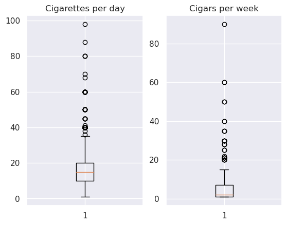
    


```python
print("Cigarettes NAs: " + str(sum(data.cigarettes.isna()/len(data))))
print("Cigars NAs: " + str(sum(data.cigars.isna()/len(data))))
```

    Cigarettes NAs: 0.6564486830155305
    Cigars NAs: 0.9785422343327954


### Drinking locations


```python
loc1 = pd.DataFrame({"location" : data.drink_loc1, "preference" : 1})
loc2 = pd.DataFrame({"location" : data.drink_loc2, "preference" : 2})
locs = pd.concat([loc1, loc2])
```


```python
sns.countplot(data=locs, y="location", hue="preference")
```


    <AxesSubplot:xlabel='count', ylabel='location'>


    
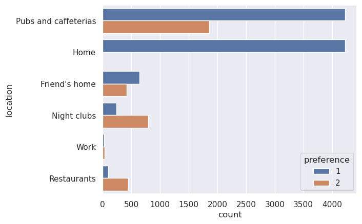
    


### political_espectrum


```python
data.political_espectrum.hist()
print_num_responses(data.political_espectrum)
```

    11697 responses out of 17616 interviewed people.


    
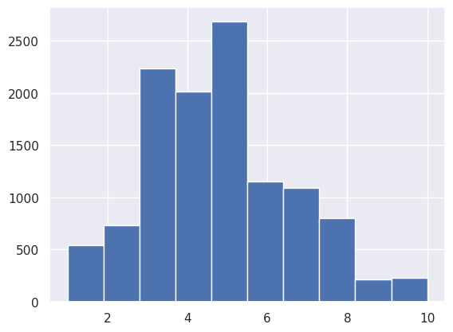
    


### age


```python
data.age.hist()
print_num_responses(data.age)
```

    17562 responses out of 17616 interviewed people.


    
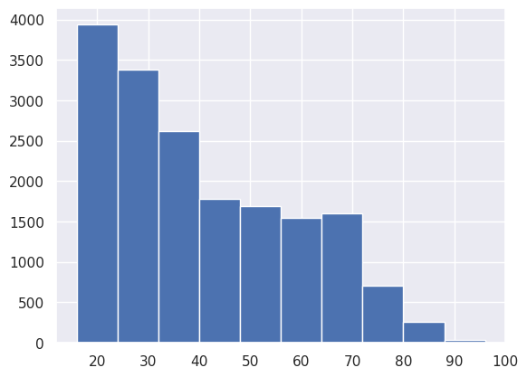
    


### income


```python
print(data.population.describe(percentiles=[0.5, 0.8, 0.9, 0.95]))
data.population.hist()
print_num_responses(data.population)
```

    count    1.759800e+04
    mean     2.870503e+05
    std      6.089171e+05
    min      1.000000e+03
    50%      3.000000e+04
    80%      2.500000e+05
    90%      7.000000e+05
    95%      2.500000e+06
    max      2.500000e+06
    Name: population, dtype: float64
    17598 responses out of 17616 interviewed people.


    
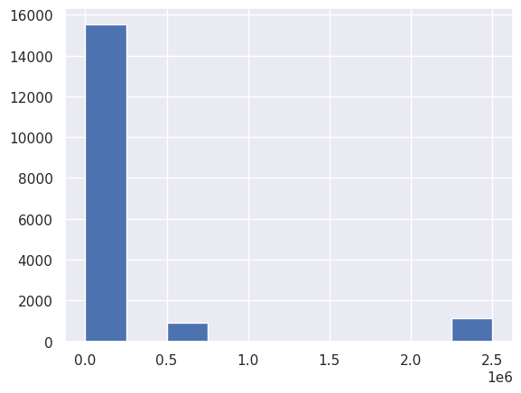
    


### occupation


```python
sns.countplot(data=data, y="occupation")
print_num_responses(data.occupation)
```

    16826 responses out of 17616 interviewed people.


    
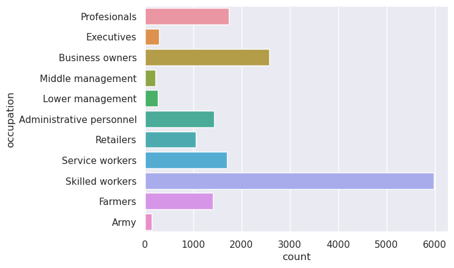
    


### socioeconomic_condition

Socioeconomic Condition is calculated by INE from occupation, activity and laboral status. See [INE glosary](
https://www.ine.es/censo_accesible/es/glosario.html) for more information.

INE also uses the variables "Average Socioeconomic Condition" and "Reference person in household socioeconomic condition", althought this pool only labeled the variable as "Socioeconomic condition".


```python
sns.countplot(data=data, y="socioeconomic_condition")
print_num_responses(data.socioeconomic_condition)
```

    17048 responses out of 17616 interviewed people.


    
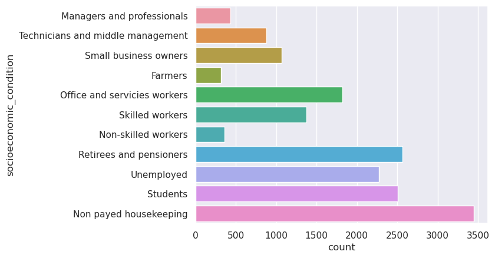
    


```python
subdata = data.query("socioeconomic_condition == 'Students'")
sns.countplot(data=subdata, y="occupation").set(title="Students occupations")
print_num_responses(subdata.occupation)
```

    2330 responses out of 2505 interviewed people.


    
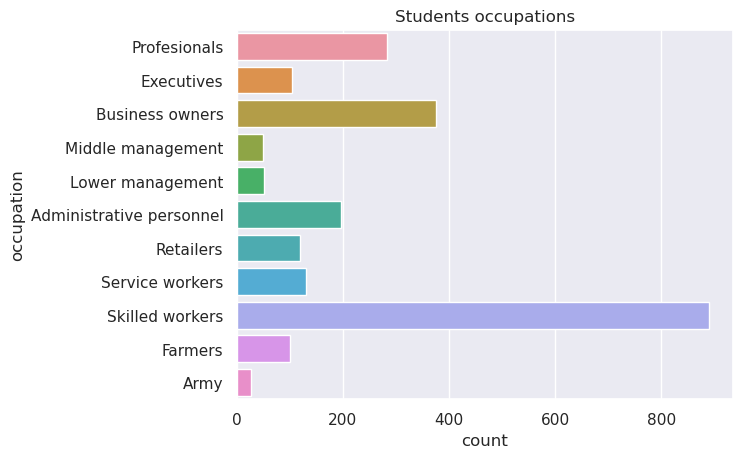
    


```python
subdata = data.query("socioeconomic_condition == 'Non payed housekeeping'")
sns.countplot(data=subdata, y="occupation").set(title="Non payed housekeepers occupations")
print_num_responses(subdata.occupation)
```

    3267 responses out of 3449 interviewed people.


    
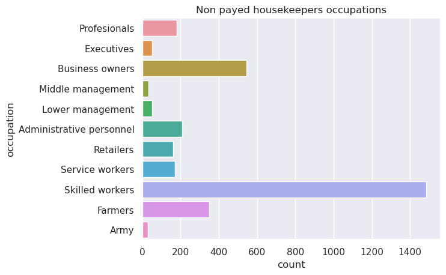
    


### sex


```python
data.sex.value_counts(dropna=False)
```


    female    9016
    male      8576
    NaN         24
    Name: sex, dtype: int64


### education_level


```python
sns.countplot(data=data, y="education_level")
print_num_responses(data.education_level)
```

    17616 responses out of 17616 interviewed people.


    

    


### sector


```python
sns.countplot(data=data, y="sector")
print_num_responses(data.sector)
```

    16991 responses out of 17616 interviewed people.


    
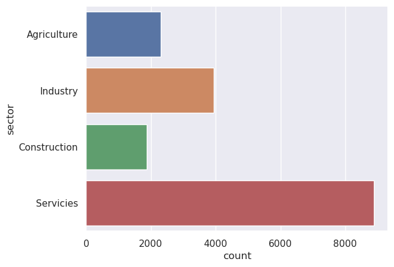
    


### status


```python
sns.countplot(data=data, y="status")
print_num_responses(data.status)
```

    16597 responses out of 17616 interviewed people.


    
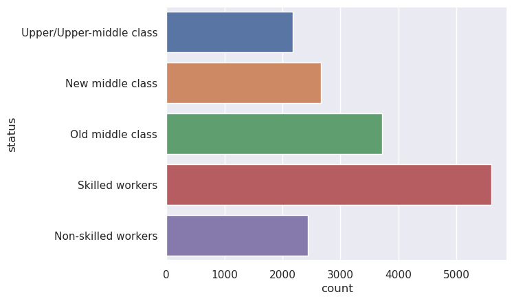
    


### UBEs


```python
data.UBE.hist()
```


    <AxesSubplot:>


    
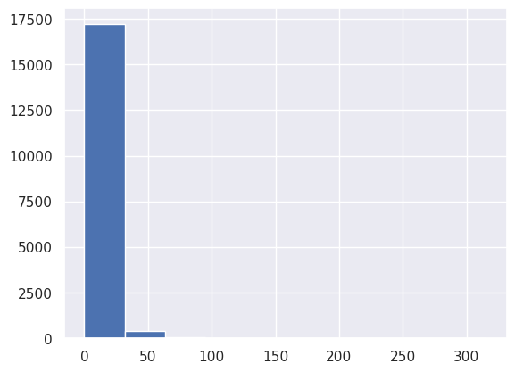
    


```python
np.log1p(data.UBE).hist()
```


    <AxesSubplot:>


    

    


```python
np.log(data.query("UBE > 0").UBE).hist()
```


    <AxesSubplot:>


    
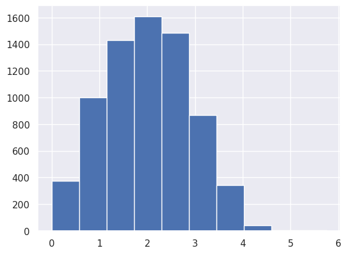
    


```python
np.exp(2)
```


    7.38905609893065


### Factor plot sex, age, UBE

Age vs UBE vs sex is the most revealing.


```python
sns.catplot(x="UBE", y="age", hue="sex", data=data)
```


    <seaborn.axisgrid.FacetGrid at 0x7f79cc14abf0>


    
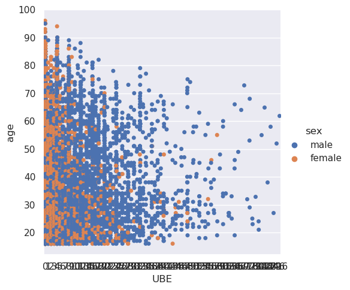
    


For income, we filter outliers of more than 100 UBEs in the 3 measured days.


```python
sns.catplot(x="income", y="UBE", hue="sex", data=data.query("UBE < 100"))
```


    <seaborn.axisgrid.FacetGrid at 0x7f79cc149ed0>


    
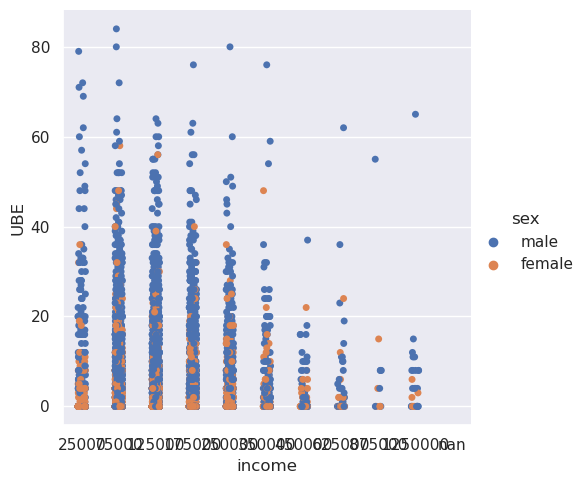
    


Do people who earn more drink less? Or are they just a smaller group? Keep in mind that points get overlaped in these plots.


```python
sns.catplot(x="UBE", y="age", hue="income", data=data)
```


    <seaborn.axisgrid.FacetGrid at 0x7f79cc015bd0>


    
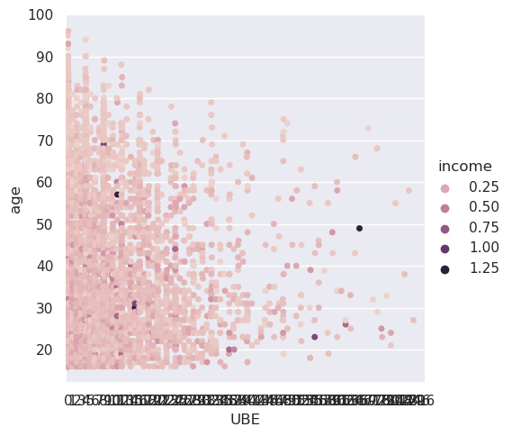
    

